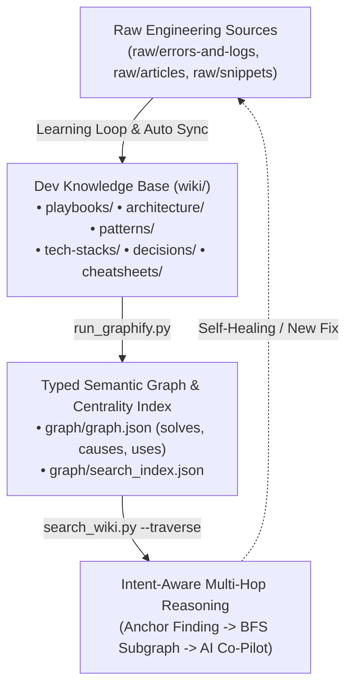

# 🧠 Dev Brain — Living Developer Knowledge Base & Engineering Second Brain (v1.0)

**Dev Brain** คือคลังสมองวิศวกรรมซอฟต์แวร์ สถาปัตยกรรมระบบ รูปแบบโค้ด และคู่มือแก้บั๊กเชิงความหมาย (Semantic Engineering Knowledge Graph) ที่ออกแบบตามแนวคิด **LLM Wiki Pattern & Multi-Hop Graph Reasoning** สำหรับทำงานร่วมกับ **Obsidian** และ **AI Coding Agents (Antigravity / Gemini / Claude)**

---

## 🏛️ สถาปัตยกรรม 4 เสาหลัก (Architecture)



- **`raw/`**: แหล่งข้อมูลดิบ (Single Source of Truth - ห้ามแก้ไข)
  - `errors-and-logs/` — Stack Traces, Debug logs หน้างาน
  - `articles/` — บล็อกเทคนิค, เปเปอร์, บทความ
  - `snippets/` — โค้ดดิบ, สคริปต์, Config files
  - `releases/` — Release notes, Migration guides
- **`wiki/`**: คลังความรู้ที่ AI สกัด จัดหมวดหมู่ และเชื่อมโยงด้วย `[[Wikilinks]]` และ Typed Relations
  - `playbooks/` — Debugging Runbooks (Symptoms -> Root Cause -> Fix)
  - `architecture/` — System Design, Microservices, Data Flow
  - `patterns/` — Design Patterns, Clean Code, Concurrency
  - `tech-stacks/` — Languages, Frameworks, Databases
  - `cheatsheets/` — คำสั่งพร้อมใช้ (Docker, Git, Regex, SQL)
  - `decisions/` — ADRs & การเปรียบเทียบ Tech Stacks
  - `summaries/` & `synthesis/` — สรุปและบทวิเคราะห์เปรียบเทียบเชิงลึก
- **`graph/`**: โครงข่ายความสัมพันธ์เชิงความหมายและดัชนีค้นหา (`graph.json` v2.0, `search_index.json`)
- **`scripts/`**: เครื่องมือตรวจสอบสุขภาพ สมอง และการเรียนรู้แบบ Closed Loop

---

## 🚀 คำสั่งสำคัญ (CLI Commands)

### 1. 🔄 The Autonomous Learning Loop (บันทึก Error และเรียนรู้อัตโนมัติ)
```bash
# ป้อนข้อมูลแบบ Interactive หรือระบุ Flags
python scripts/learn_error.py \
  --title "PostgreSQL Connection Pool Exhaustion" \
  --error "FATAL: remaining connection slots are reserved" \
  --root-cause "Client connections leaked without defer/release" \
  --fix "Set max connection lifetime and deploy PgBouncer" \
  --tech "PostgreSQL,PgBouncer"
```

### 2. 🧠 ค้นหาความรู้แบบ Multi-Hop Graph Traversal
```bash
# ค้นหาพร้อมเดินโครงข่ายความสัมพันธ์เชิงความหมายลึก 2 Hops
python scripts/search_wiki.py "PostgreSQL Connection Leak" --depth 2

# กรองเฉพาะความสัมพันธ์ที่แก้ปัญหาหรือป้องกัน
python scripts/search_wiki.py "Connection Timeout" --relation "solves,mitigates"

# ส่งออก Subgraph Context เป็น JSON สำหรับ Subagent / LLM Prompt
python scripts/search_wiki.py "PostgreSQL" --context
```

### 3. 🧹 ตรวจสอบสุขภาพคลังความรู้ (Semantic Linter)
```bash
python scripts/lint_wiki.py
```

### 4. 📊 อัปเดต Graph & Hybrid Search Index (Schema v2.0)
```bash
python scripts/run_graphify.py
```

### 5. 📦 ซิงค์โปรเจกต์จาก Git Repositories และ Local Folders (Auto-Sync)
```bash
# ซิงค์ทุกโปรเจกต์ที่ระบุใน repositories.md
python scripts/sync_projects.py

# หรือซิงค์โปรเจกต์พร้อมตั้งชื่อเฉพาะ (Custom Alias Name)
python scripts/sync_projects.py . --name "Farmer-POS"
python scripts/sync_projects.py "https://github.com/owner/repo.git" -n "Core-API"
```

---

## 🤖 การทำงานร่วมกับ AI Agent ในโปรเจกต์โค้ด (Coding Workflow)
Dev Brain ขับเคลื่อนด้วยโปรโตคอลใน [GEMINI.md](GEMINI.md) และ [AGENTS.md](AGENTS.md) เมื่อคุณกำลังเขียนโค้ดในโปรเจกต์อื่น (ใน VS Code, Cursor, Antigravity):
- **วิธีใช้งานที่ง่ายที่สุด (Multi-Root Workspace)**: แค่กด `File > Add Folder to Workspace...` แล้วเลือกโฟลเดอร์ `dev-brain` เข้ามาเปิดคู่กับโปรเจกต์โค้ดของคุณ
- **สั่งงานได้ทันที**: คุณสามารถบอก Agent ในแชทได้ทันที เช่น:
  - *"ซิ้ง (หรือ ingest / scan) โปรเจกต์นี้ลง dev-brain หน่อย"* (หรือระบุชื่อ: *"ซิ้งโปรเจกต์นี้ ตั้งชื่อว่า `Farmer-POS` ให้หน่อย"*)
  - *"อ่านสถาปัตยกรรมจาก dev-brain มาช่วยเขียนฟีเจอร์นี้หน่อย"*
  - *"เจอบั๊กนี้ ช่วยแก้และบันทึกลง brain ให้ด้วย"* ➡️ ระบบจะสร้าง Playbook เก็บเข้าคลังสมองให้อัตโนมัติ
*(โดยไม่ต้องพิมพ์ Path หรือสร้างไฟล์ Config ใด ๆ ในโปรเจกต์โค้ดของคุณเลยแม้แต่ไฟล์เดียว)*


